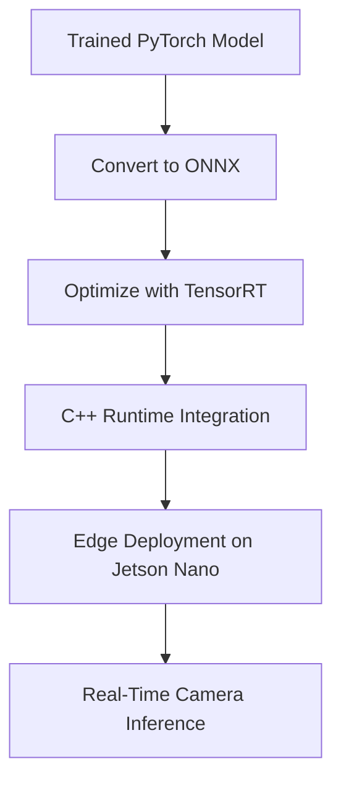

# ⚙️ Embedded Systems, Real-Time Programming, and Edge AI Roadmap – By Afsar Ahamed

## 🎯 Goal
Master low-level systems programming with C++, real-time operating systems, embedded development, GPU programming (CUDA), and edge AI deployment (TensorRT), while exploring modern alternatives like Rust and understanding the broader IoT and distributed systems landscape. This roadmap builds the foundation for robotics, smart devices, and intelligent real-time systems.

---

## 📍 Phase 0: Orientation – Why This Path?

### 🔎 What You'll Learn
- Why **C++ is used for both general and embedded systems**
- How **embedded C++** differs: no dynamic memory, stricter rules, safety-first, minimal STL use
- What makes **embedded environments** special (low power, low memory, hard real-time)
- Why we use **RTOS** and not just `while(true)` loops
- Why **GPU acceleration matters** and how CUDA helps
- **cuDNN vs TensorRT vs CUDA**: when to use what
- What is **IoT** and how it's a form of **distributed system** with sensors and micro-clouds
- What is **Rust**, and how it compares to C++ in embedded contexts

✅ **Outcome**: Clear mental model of the landscape from C++ basics → device logic → distributed edge AI

---

## 📍 Phase 1: Foundational C++ vs Embedded C++

### 🧠 Key Concepts
- What is "normal" C++: full STL, dynamic memory, RAII, exceptions
- What is "embedded" C++: safety-oriented subset, no heap, no exceptions, no RTTI
- Bitwise operations, hardware-level memory access
- Use of `volatile`, `const`, `static` with sensors & hardware registers
- Why `malloc/new` is avoided on MCUs
- CMake basics for embedded targets

### 📦 Projects
- Create C++ console app using full STL (sorting, vectors, etc.)
- Recreate logic using embedded-safe C++ patterns
- Write a mock embedded driver (no heap, no exceptions)

---

## 📍 Phase 2: Embedded Systems & Sensor Interfaces

### 🧠 Key Concepts
- MCU architecture: STM32, ESP32, Cortex-M
- GPIO, ADC, PWM, SPI, I2C, UART protocols
- Hardware interrupts and polling
- Digital vs analog sensors
- Edge-to-cloud architecture basics

### 📦 Projects
- Light sensor + LED dimming via PWM
- UART command interface
- I2C read from temperature sensor with conversion logic

---

## 📍 Phase 3: Real-Time Operating Systems (RTOS)

### 🧠 Key Concepts
- What is a Real-Time System? (determinism vs performance)
- FreeRTOS and Zephyr basics
- Tasks, ISRs, synchronization (queues, semaphores, mutexes)
- Clock accuracy, watchdog timers
- System design for reliability and safety

### 📦 Projects
- Motion sensor interrupt handler + logger
- Preemptive task scheduler demo
- Sensor fusion using multiple inputs on separate threads

---

## 📍 Phase 4: GPU Programming with CUDA & cuDNN

### 🧠 Key Concepts
- CUDA memory layout: shared vs global vs local memory
- Threads, blocks, kernels: launching parallel code
- cuDNN: high-level deep learning acceleration on CUDA
- How to write and profile your own CUDA kernels

### 📦 Projects
- Matrix multiplication on CPU vs GPU
- Real-time image convolution with CUDA
- Speed benchmark report with and without cuDNN

---

## 📍 Phase 5: TensorRT for Edge AI Inference

### 🧠 Key Concepts
- Model flow: PyTorch → ONNX → TensorRT `.engine`
- Optimizations: FP16, INT8, layer fusion
- Jetson Nano/Xavier: deploy inference pipelines
- Integrating with sensors and real-time data sources

### 📦 Projects
- YOLOv5 camera detection using TensorRT
- Real-time object detection loop with visual overlay
- Edge alert: motion detected → classify → MQTT publish

---

## 📍 Phase 6: IoT + Distributed Thinking

### 🧠 Key Concepts
- IoT = smart nodes + connectivity + sensors + feedback
- MQTT, HTTP, BLE, CoAP: protocols for distributed messaging
- Time sync, fault tolerance, offline resilience
- Gateway devices, microservices on the edge (Jetson as cloud gateway)
- Integrating data from distributed sensors to cloud dashboards

### 📦 Projects
- Sensor farm (ESP32 → Jetson MQTT Broker → Cloud)
- Local dashboard with fallback logic
- OTA firmware update simulator

---

## 📍 Phase 7: Rust for Embedded (Optional)

### 🧠 Key Concepts
- Why Rust matters: safe memory access, zero-cost abstractions
- `no_std`, RTIC real-time concurrency model
- Compare C++ ISR vs Rust RTIC task models
- Rust crate ecosystem: `embedded-hal`, `cortex-m`, `panic-halt`

### 📦 Projects
- LED blink in Rust
- Rust UART echo server
- RTIC task scheduler with sensor + log task

---

## 📎 Sensor-to-Cloud Data Pipeline (IoT Flow Overview)

```mermaid
graph TD;
    A[Sensor (ESP32, STM32)] --> B[Data Processing (RTOS Task)]
    B --> C[Jetson Nano Edge AI Model (TensorRT)]
    C --> D[MQTT Broker / API]
    D --> E[Cloud Dashboard / Notification]
```

✅ This illustrates how **sensors feed embedded logic**, which triggers **AI on the edge**, then shares data via **distributed protocols** to the cloud.

---

## 📎 TensorRT Inference Pipeline (AI Flow Overview)



---

## 📂 Final Deliverables Checklist

✅ Modular GitHub repos per phase  
✅ Diagrams: task flow, memory layout, sensor→cloud pipeline  
✅ Video demos or GIFs per milestone  
✅ Blog write-ups explaining key decisions  
✅ Portfolio site or Notion dashboard showing everything

---

## ✅ Final Tech Stack Summary

| Category             | Tools / Technologies                          |
|----------------------|-----------------------------------------------|
| Language             | C++, Rust (optional)                          |
| Embedded Platforms   | STM32, ESP32, Arduino, Jetson Nano           |
| Build Systems        | CMake, Make, PlatformIO                      |
| RTOS                 | FreeRTOS, Zephyr                             |
| GPU Programming      | CUDA, cuDNN                                  |
| Inference Runtime    | TensorRT, ONNX                               |
| Communication        | UART, I2C, SPI, MQTT, BLE                    |
| Debugging            | GDB, Serial Monitor, Logic Analyzer          |
| Dev Tools            | VSCode, STM32CubeIDE, NVIDIA SDK, Jupyter    |

---

👤 **Created by Afsar Ahamed – Master's in Machine Learning & Computer Vision**  
📂 GitHub: [github.com/afsaraj](https://github.com/afsaraj)

